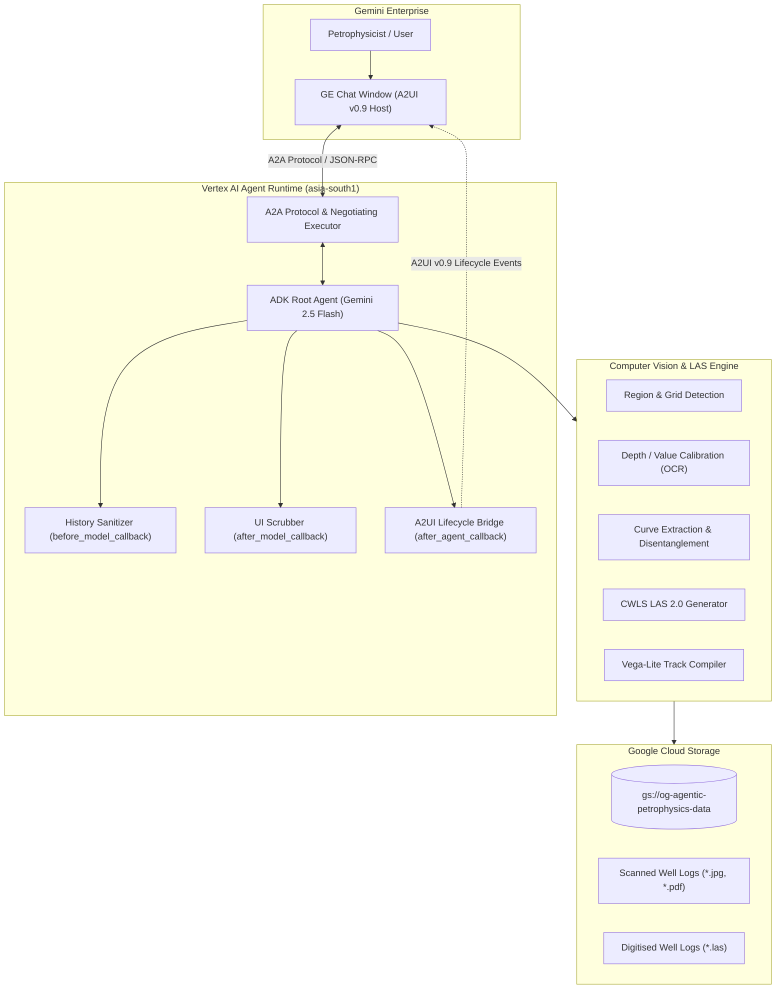

# Log Digitisation Agent (v0.1)

> **Autonomous Petrophysical Well Log Digitisation & Interactive Multi-Track A2UI Visualization for Gemini Enterprise**

[](https://www.python.org/downloads/)
[](https://google.github.io/adk-docs/)
[](https://a2ui.org)
[]()
[]()
[]()

---

## Overview

Decades of historical oil and gas exploration records are trapped in physical paper well logs, raster TIFFs, PDFs, and scanned JPEGs. Manual digitisation requires days of tedious cross-track tracing and remains prone to human transcription errors.

The **Log Digitisation Agent** is a production-grade autonomous petrophysicist agent built on the **Google Agent Development Kit (ADK)** and deployed to **Vertex AI Agent Runtime**. Accessible directly from **Gemini Enterprise chat**, it provides an end-to-end, conversational workflow to:

1. **Inventory & Inspect**: Survey Cloud Storage buckets for un-digitised scanned sheets (JPEG, PNG, PDF) vs. completed LAS files.
2. **Display Original Scans**: Render high-resolution raster sheets directly inside Gemini Enterprise chat via A2UI base64 components.
3. **Trace & Calibrate**: Apply computer vision to detect track boundaries, parse depth/value scales via OCR, separate overlapping colored/dashed curves, and calibrate linear & logarithmic axes.
4. **Publish Standard LAS 2.0**: Formulate and write certified CWLS LAS 2.0 files directly to Google Cloud Storage under its own dedicated Service Account.
5. **Interactive Visualization**: Automatically render digitised logs as synchronized 3-track Vega-Lite charts with cross-track zoom, pan, and hover tooltips within chat.

---

## System Architecture



---

## Log Curves & Track Layout

The digitisation engine models standard petrophysical 3-track layouts across measured depth (FT):

| Track | Curve | Mnemonic | Scale | Unit | Visual Appearance | Description |
|---|---|---|---|---|---|---|
| **Track 1** | Gamma Ray | `GR` | 0 – 150 | GAPI | Green Solid | Lithology / shale indicator |
| **Track 1** | Spontaneous Potential | `SP` | -80 – 20 | mV | Red Solid | Permeable zone identification |
| **Track 2** | Shallow Resistivity | `RXO` | 0.2 – 2000 | ohm-m | Black Solid (Logarithmic) | Flushed zone resistivity |
| **Track 2** | Medium Resistivity | `ILM` | 0.2 – 2000 | ohm-m | Black Dashed (Logarithmic) | Transition zone resistivity |
| **Track 2** | Deep Resistivity | `ILD` | 0.2 – 2000 | ohm-m | Black Long-Dashed (Logarithmic) | Uninvaded formation resistivity |
| **Track 3** | Neutron Porosity | `NPHI` | 0.45 – -0.15 | v/v | Blue Dashed | Hydrogen index / porosity |
| **Track 3** | Bulk Density | `RHOB` | 1.95 – 2.95 | g/cm³ | Red Solid | Formation bulk density |

---

## Conversational Workflow & Safety Guardrails

The agent enforces strict human-in-the-loop and security controls:

- **Refusal to Guess**: If the user asks to see or digitise a scan and multiple matches exist (e.g. `a.jpg` and `a.pdf`), the agent lists candidates and asks for clarification.
- **Mandatory Confirmation**: Writing a `.las` file writes permanent data to Cloud Storage. The agent always explains what scan will be processed, where the LAS will be saved, and waits for explicit user confirmation before invoking `digitise_scanned_log`.
- **History Sanitization (`before_model_callback`)**: Strips raw `<a2a_datapart_json>` envelopes and base64 payloads from prior turns before sending context to Gemini, preventing runaway token exhaustion loops.
- **Token Ceiling**: Enforces `max_output_tokens=1024` as a hard backstop against model hallucination loops.

---

## Project Structure

```
Well-Log-Digitization/
├── app/
│   ├── calibrate/             # Grid detection, depth ticks, linear/log scale calibration
│   ├── contracts/             # Domain dataclasses, LAS definitions, A2UI message schemas
│   ├── detect/                # OCR header parsing, annotation removal, track segmentation
│   ├── digitise/              # Curve tracing, color filtering, CWLS LAS 2.0 generator
│   ├── gcs/                   # GCS inventory client, object reading & streaming
│   ├── ingest/                # Raster image loading, multi-page PDF conversion
│   ├── integration/           # ADK Agent definition, tool bindings, lifecycle callbacks
│   │   ├── agent.py           # Root agent with before/after model callbacks
│   │   ├── agent_card.py      # A2A AgentCard with A2UI v0.9 extension capability
│   │   ├── executor.py        # A2UI negotiating executor
│   │   └── tools.py           # Tools: list_well_logs, show_scanned_log, digitise_scanned_log
│   ├── render/                # A2UI v0.9 surfaces: Vega-Lite charts, inventory cards, scan viewer
│   ├── app_utils/             # A2A endpoints, FastAPI adapter, session handling
│   └── fast_api_app.py        # FastAPI server entry point
├── docs/                      # Engineering documentation, BUILD.md, CHECKLIST.md, sample scan
├── scripts/                   # Verification tools & compile checks
├── tests/
│   ├── unit/                  # 488 unit tests covering all modules
│   └── integration/           # End-to-end server & A2A protocol tests
├── pyproject.toml             # uv package definition & dependencies
├── agents-cli-manifest.yaml   # Google Agents CLI deployment metadata
├── deployment_metadata.json   # Vertex AI Reasoning Engine mapping
└── README.md                  # Project documentation
```

---

## Getting Started

### Prerequisites

- **Python 3.11+**
- **uv** package manager: `curl -LsSf https://astral.sh/uv/install.sh | sh`
- **Google Cloud SDK** (`gcloud`) authenticated with access to Vertex AI and Cloud Storage.

### Installation

```bash
git clone git@github.com:amandeepsinghs-cyber/Well-Log-Digitization.git
cd Well-Log-Digitization

# Install dependencies into virtual environment
uv sync
```

### Running Tests

The test suite validates every stage of the pipeline without requiring live cloud credentials:

```bash
# Run all 488 unit tests
uv run pytest tests/unit

# Check code formatting and linting
uvx ruff check app tests
```

### Local Development

Launch the local FastAPI server with A2A protocol and playground support:

```bash
uv run python app/fast_api_app.py
```

Visit `http://localhost:8000/docs` to inspect the OpenAPI schema.

---

## Deployment to Vertex AI Agent Runtime

Deploy directly using `agents-cli`:

```bash
agents-cli deploy --project <YOUR_GCP_PROJECT_ID>
```

Deployment registers the agent in Vertex AI Reasoning Engine and publishes the agent card to Gemini Enterprise, advertising native A2UI v0.9 extension capabilities.

---

## Quality & Validation Gates

| Gate | Scope | Status |
|---|---|---|
| **Gate 0** | A2UI Wire Format & Envelope Serialization | ✅ Passed |
| **Gate 1a** | Cloud Storage Inventory & Object Streaming | ✅ Passed |
| **Gate 2** | Image Calibration, Grid Detection & Depth Alignment | ✅ Passed |
| **Gate 3** | Curve Tracing & Color/Dash Disentanglement | ✅ Passed |
| **Gate C** | End-to-End CWLS LAS 2.0 Output under Service Account | ✅ Passed |
| **Gate 1** | Live Multi-turn Verification in Gemini Enterprise Chat | ✅ Passed |

---

## License

Apache License 2.0. See [LICENSE](LICENSE) for details.
