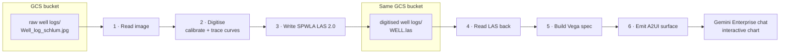
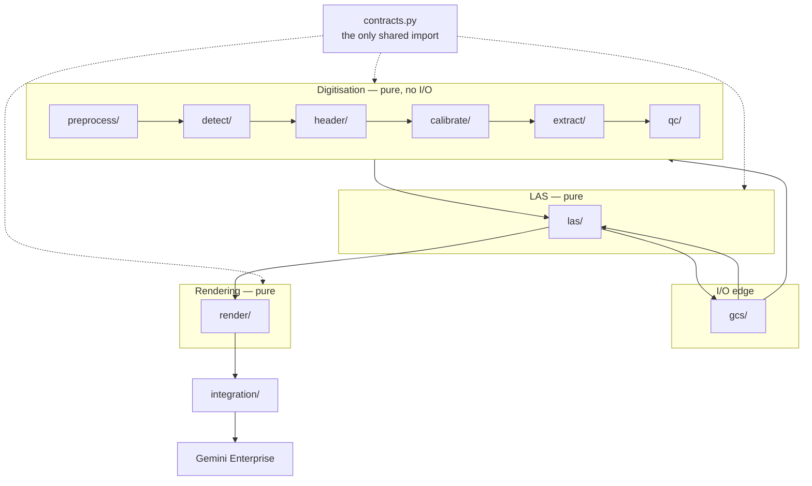
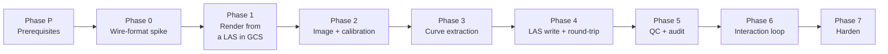

# Log Digitisation Agent — Build Plan

## Objective

Access a scanned well-log image from a **GCS bucket**, digitise it into a **standardised SPWLA/CWLS
LAS 2.0 file**, write that LAS back to the **same bucket** under `digitised well logs/`, then read
it back from GCS and render it as an **interactive multi-track chart in the Gemini Enterprise chat
interface** via A2UI.

**Reference input:** `Well_log_schlum.jpg` — three-track Schlumberger-style display, 7,000–7,300 ft.

**Status:** plan only. No code written. Nothing reused from earlier prototypes.

### The flow



### Why the GCS round-trip matters architecturally

The LAS file in GCS is the **contract between two independent halves**. Rendering never reads the
digitiser's in-memory output; it reads the persisted LAS, exactly as any downstream consumer
(Petrel, Techlog, a data scientist) would.

| Consequence | Benefit |
|---|---|
| **Two independent pipelines** | Digitisation and rendering can be built, tested and broken separately |
| **Rendering is testable with a hand-written LAS** | The whole chart path can be proven before any image processing exists |
| **The LAS is provably valid** | If our own renderer can consume it, so can Petrel. Round-tripping is the test |
| **Re-render is free** | Changing the chart requires no re-digitisation |

### The conversation this has to support

The pipeline above is the machinery. What the petrophysicist actually experiences is a
four-turn conversation, and the tool set exists to serve it:

| Turn | They say | The agent must | Tool |
|---|---|---|---|
| 1 | *"How many well logs are still only images or PDFs?"* | State a count it can stand behind, and show the files | `list_well_logs` + inventory card |
| 2 | *"Can you digitise it?"* | Say what it would read, **where it would write**, how long it takes — then **stop and wait** | `inspect_scanned_log` |
| 3 | *"Yes"* | Digitise, publish the LAS, and draw the result **in the same turn** | `digitise_scanned_log` → chart |
| 4 | *"Show me WELL_X"* | Redraw any log already digitised | `render_well_log` |

Three of these are non-obvious and are easy to get wrong by building the capability without
the experience:

- **The model cannot see the inventory card.** The card is attached by an after-agent
  callback, which runs *after* the model has finished writing. Without `list_well_logs` the
  agent can only say "see the card below" — which is not an answer to "how many".
- **Turn 2 must not write.** `digitise_scanned_log` publishes to the user's bucket and takes
  a minute or two. The confirmation is enforced in the agent instruction, not in the tool:
  the tool stays callable so a user who says "digitise Well_log_schlum.jpg, go ahead" in one
  breath is not asked twice.
- **Turn 3 must draw.** Digitising queues its own output for the chart callback. Requiring a
  separate "now show me" turn makes the product feel like a file converter rather than an
  analyst.

### Input formats — PDF is a container, not a second pipeline

A scanned log arrives as an image or as a PDF wrapping the same raster. `ingest/load_pdf.py`
renders page 1 and hands BGR pixels to `ingest/load_image.py`, which remains the single
decode point; no stage downstream can tell which format the scan arrived in.

| Decision | Reason |
|---|---|
| **Sniff `%PDF-`, not the extension or GCS content type** | Both are set by whoever uploaded the file and are routinely wrong |
| **Render at the embedded raster's OWN resolution** | A scanned PDF is a raster in a wrapper; resampling it is pure loss. **Measured, not assumed:** the first version rendered to a fixed 1000 px, which upscaled the 919 px reference sheet by 1.088×, moved the depth grid, and put a header text block within half a grid pitch of a rule — it was taken for a depth label and the whole sheet failed to inspect. Rendering at native resolution reproduces the JPEG path's numbers exactly (0.520 ft/px, RMSE 0.142) |
| **Never upscale; downscale only above 2000 px** | Interpolated pixels give the tracer detail the scanner never captured. A 300 dpi letter scan is ~2550 px, far outside the ~919 px regime the extraction thresholds and annotation line-thickness heuristics were tuned in, so those are scaled down to 1000 px |
| **Refuse multi-page PDFs** | Publishing page 1 of five as "the well log" would silently drop four fifths of the well |
| **Vector PDF extraction is NOT built** | A born-digital PDF stores its curves as path geometry, which would digitise near-perfectly — no tracing, no colour separation, no curve-over-curve occlusion. It is a second extraction backend replacing `separate.py` and `trace.py`, ~2–3 days, and it pays off only on files we do not currently have. Deferred deliberately, not overlooked |

> A PDF buys input flexibility, not accuracy. A scanned PDF digitises exactly as well as the
> image inside it, gaps and all.

---


## Part 1 — Review: what the ADK/A2UI article changes

Source: *Building Native Conversational UIs on Google Cloud: A Deep Dive into ADK, A2UI and Gemini*
(Sanu Ghosh, Google Cloud, June 2026).

### 1.1 Three findings that contradict the obvious design

> [!CAUTION]
> Each of these fails **silently** — no error, no chart, nothing in logs. They are the difference
> between a working demo and two days of blind debugging.

| # | Finding | Naive assumption | What the article shows |
|---|---|---|---|
| **1** | **One Part per message** | Send all lifecycle messages as one JSON array in a single Part | `_wrap_a2ui_part(a2ui_message)` wraps **one** message. `beginRendering`, `surfaceUpdate` and `dataModelUpdate` are **three separate Parts** |
| **2** | **ADK-side wire format is `text/plain`** | `Part(inline_data=Blob(mime_type="application/json+a2ui"))` | ADK emits `text/plain` wrapped in `<a2a_datapart_json>…</a2a_datapart_json>` markers. The executor converts it to a real A2A DataPart where `metadata.mimeType` becomes `application/json+a2ui` |
| **3** | **Extension needs runtime negotiation** | Declaring the extension on the agent card is sufficient | `try_activate_a2ui_extension(context, agent_card)` runs **at the executor level**, inspects the client's request context, and activates the version the client actually supports |

The wrapper from the article, for reference:

```python
def _wrap_a2ui_part(a2ui_message: dict[str, Any]) -> types.Part:
    payload = {"kind": "data", "data": a2ui_message}
    json_str = json.dumps(payload)
    blob_data = f"<a2a_datapart_json>{json_str}</a2a_datapart_json>".encode("utf-8")
    return types.Part(inline_data=types.Blob(data=blob_data, mime_type="text/plain"))
```

Note the `{"kind": "data", "data": …}` envelope around each message — also easy to miss.

### 1.2 Other material learnings

| Learning | Consequence for this build |
|---|---|
| **`deleteSurface` is a fourth lifecycle message** | Tear down the chart when the user switches wells, or stale surfaces accumulate |
| **`A2uiSchemaManager` exists** | ADK can auto-generate the prompt + schema so the **LLM authors** the A2UI JSON. Right for small control surfaces, **wrong for our ~100 KB chart payload** — see §1.3 |
| **v0.8 vs v0.9 ambiguity** | Article calls **v0.8 current stable**, v0.9 "upcoming". Other evidence says GE ships a v0.9 renderer. **Settle empirically in Step 3** — field names differ entirely |
| **v0.8 data model is typed** | v0.8 `contents` uses `{"key":…, "valueString":…}` / `valueMap`. v0.9 `updateDataModel` uses a plain mapping. Not interchangeable |
| **Icons come from a whitelist** | No arbitrary icons |
| **`List` binds an array to a card template** | The right component for the curve inventory — not a markdown table |
| **Interaction returns as `userAction`** | A new turn carrying structured form state. This is the "re-render this depth window" loop |
| **HITL review-card pattern** | Directly reusable as the *approve before writing LAS to the lake* gate |

### 1.3 The decision the article forces

`A2uiSchemaManager` has the LLM generate A2UI JSON from a schema-guided prompt. Elegant for a
booking form. **Impossible for a log chart**: ~100 KB of numeric data, far beyond any model's
reliable output budget, and one mistyped character silently corrupts the render.

| Surface | Path | Why |
|---|---|---|
| **Chart** (bulk data) | Built deterministically in Python, emitted from a callback. LLM never sees it | Size and fidelity |
| **Controls** (buttons, depth inputs, approval card) | May use schema-guided generation | Small, benefits from flexibility |

---

## Part 2 — Architecture

### 2.1 The modularity rule

**One file, one job.** Core modules **never import each other** — only `contracts.py`. All wiring
lives in `integration/`.

Style is governed by [CODING_GUIDELINES.md](./CODING_GUIDELINES.md): commented for readability ·
only code that does something · to the point and operational · **use a library, never reinvent the
wheel**.



| Rule | Detail |
|---|---|
| One job per file | If describing it needs "and", split it |
| No cross-imports | Only `contracts.py` may be imported by core modules |
| Pure core | Take data, return data. No I/O, no globals, no network |
| I/O in one place | Only `gcs/` touches Cloud Storage. Only `bq/` touches BigQuery |
| Thin integration | `pipeline_*.py` calls and passes. No logic |
| One test per module | `tests/unit/test_<module>.py` mirrors the tree |

**Why the discipline is worth it here:** this system has roughly a dozen failure modes that all
present identically — a blank or wrong chart. Module isolation turns "the chart is empty" into
"`calibrate/log_axis.py` returned negative values".

### 2.2 File manifest

**`contracts.py`** — the only shared import.
`RasterImage`, `TrackBounds`, `AxisCalibration`, `DepthCalibration`, `CurveTrace`, `CurveSample`,
`LasDocument`, `QcFinding`, `DigitisationResult`, `A2uiMessage`.

| Stage | File | Job |
|---|---|---|
| **`gcs/`** | `client.py` | Construct an authenticated storage client |
| | `list_images.py` | List source images under `Scanned Well Logs/` |
| | `read_bytes.py` | Object → bytes |
| | `write_bytes.py` | Bytes → object |
| | `list_las.py` | List LAS files under `Digitised Well Logs/` |
| | `paths.py` | Bucket layout constants and key builders |
| **`preprocess/`** | `deskew.py` | Detect and correct rotation |
| | `denoise.py` | Remove scan speckle |
| | `binarise.py` | Adaptive threshold → ink mask |
| | `remove_grid.py` | Subtract gridlines from the ink mask |
| | `rectify.py` | **Homography from gridline intersections** — undo paper stretch and scanner distortion |
| **`detect/`** | `track_bounds.py` | Vertical separators → `list[TrackBounds]` |
| | `gridlines.py` | Horizontal and vertical gridlines (OpenCV Hough) |
| | `depth_ticks.py` | Depth label positions |
| | `header_region.py` | Isolate the header block above each track |
| **`header/`** | `ocr_header.py` | **Gemini vision call.** Header crop → raw text. The only LLM call in the pipeline |
| | `parse_scales.py` | Pure: text → mnemonic, unit, min, max, linear/log |
| | `parse_depth_units.py` | Pure: ft vs m, and the depth label values |
| **`calibrate/`** | `depth_axis.py` | Pixel row → depth (least-squares over ticks) |
| | `linear_axis.py` | Pixel column → value, linear |
| | `log_axis.py` | Pixel column → value, logarithmic |
| | `validate_calibration.py` | Residual checks; refuse to proceed on a bad fit |
| **`extract/`** | `separate_colour.py` | Split overlapping curves by stroke colour |
| | `separate_dash.py` | Split by dash pattern (the three resistivity curves) |
| | `trace_curve.py` | Ink mask column → one pixel value per depth row |
| | `continuity.py` | **Physics prior** — resolve crossings by continuity; a curve cannot jump without a rock transition |
| | `despike.py` | Remove crossing artefacts and annotation collisions |
| | `resample.py` | Uniform depth step; decimate for transport |
| **`las/`** | `mnemonics.py` | **SPWLA standard mnemonic and unit mapping.** Ours — domain data, not an algorithm |
| | `write_las.py` | `lasio` writer. `DigitisationResult` → CWLS LAS 2.0, gaps as `NULL -999.25` |
| | `parse_las.py` | `lasio` adapter. LAS text → `LasDocument`. The read-back path |
| | `validate_las.py` | CWLS 2.0 conformance via `lasio` + our SPWLA mnemonic check |
| **`qc/`** | `coverage.py` | Fraction of depth range traced, per curve |
| | `range_check.py` | Flag values outside the declared scale |
| | `confidence.py` | Per-curve confidence score |
| | `report.py` | Assemble `list[QcFinding]` |
| **`render/`** | `track_layout.py` | `LasDocument` → which curves sit in which track |
| | `vega_track.py` | One track → one Vega-Lite layered view |
| | `vega_spec.py` | Assemble tracks → full `hconcat` spec |
| | `a2ui_envelope.py` | Wrap one message per §1.1 findings 1 and 2 |
| | `a2ui_lifecycle.py` | `createSurface` / `updateComponents` / `updateDataModel` / `deleteSurface` |
| | `a2ui_controls.py` | Depth-window input, re-render button, approval card |
| | `inventory_card.py` | The bucket inventory as an A2UI card |
| | `scan_image.py` | The scanned sheet itself, as a base64 `data:` URI in an `Image` |
| | `a2ui_emit.py` | Callback that attaches the Parts |
| **`bq/`** | `index_row.py` | Insert the provenance/audit row |
| **`integration/`** | `pipeline_digitise.py` | GCS image → LAS → GCS. Calls and passes only |
| | `pipeline_render.py` | GCS LAS → Vega spec. Calls and passes only |
| | `tools.py` | ADK tool functions. Thin wrappers |
| | `agent.py` | `Agent` definition |
| | `executor.py` | A2UI extension negotiation per §1.1 finding 3 |
| | `agent_card.py` | Capabilities declaration |
| **`scripts/`** | `compile_check.js` | Compile + headless-render any Vega spec; repeat with GE's sizing rewrite |
| | `emit_fixture.py` | Dump a wire-format fixture for inspection |
| | `upload_reference.py` | One-off: put the reference image in the bucket |

### 2.3 Target environment and bucket layout

| Setting | Value |
|---|---|
| **Project** | `og-agentic-ecosystem` |
| **Bucket** | `og-agentic-petrophysics-data` (shared with the splice agent — all logging data lives in one project) |
| **Source folder** | `Scanned Well Logs/` |
| **Output folder** | `Digitised Well Logs/` |

```
gs://og-agentic-petrophysics-data/
├── Scanned Well Logs/            <- source raster images (input)
│   └── Well_log_schlum.jpg
└── Digitised Well Logs/          <- SPWLA LAS 2.0 output
    ├── <WELL>.las
    └── <WELL>.qc.json
```

#### Access model — decided

**Bucket-level access, deliberately.** All petrophysics agents share read/write on
`og-agentic-petrophysics-data`. Folder-scoped IAM is treated as a later optimisation, not a
prerequisite.

| Decision | Rationale |
|---|---|
| Bucket-level IAM, not Managed Folders | Simplicity now. All agents are same-domain, same-project, same sensitivity |
| Revisit later via **Managed Folders** | Note: IAM Conditions with `resource.name.startsWith` are the wrong tool — `storage.objects.list` is bucket-level and conditions do not filter list results. Managed Folders scope `list` properly |
| **One service account per agent** | Non-negotiable even under shared access — see below |

> [!IMPORTANT]
> **Observability is the compensating control.** Since every agent can reach every object, the way
> to detect an agent behaving badly is the audit trail, not the permission boundary. Two
> prerequisites:
>
> 1. **Enable GCS Data Access audit logs** (`DATA_READ`, `DATA_WRITE`, `ADMIN_READ`) on the project.
>    They are **off by default** — without them, a rogue read or overwrite leaves no record.
> 2. **Each agent runs as its own service account.** Shared access is fine; shared identity is not.
>    With one SA across agents, the audit log cannot attribute misbehaviour to a culprit.
>
> Sink the logs to BigQuery to baseline normal behaviour and alert on writes outside an agent's
> expected prefix.

> [!NOTE]
> Folder names contain spaces. Every GCS key and shell path must be quoted, and `gcs/paths.py`
> should URL-encode where the API requires it. `gcs/paths.py` remains the single place prefixes are
> defined — under shared access this is a correctness guard against an agent bug, not a security
> control.


---

## Part 3 — Step-by-step build

**One step = one file = one test.** No step creates two modules. Integration steps are explicitly
marked and are the only places where modules meet.

Eight phases. **Each ends in a hard gate. Do not start the next phase until the gate passes.**



Legend: **[env]** environment/setup · **[mod]** one new module · **[int]** integration ·
**[test]** verification only

### Phase P — Prerequisites

*Environment only. No application code.*

| Step | Type | Deliverable | Done when |
|---|---|---|---|
| P1 | [env] | `gcloud auth login` — refresh credentials | `gcloud auth list` shows an active account |
| P2 | [env] | Set project: `gcloud config set project og-agentic-ecosystem` | `gcloud config get-value project` returns it |
| P3 | [env] | Verify bucket access: list `gs://og-agentic-petrophysics-data/` | Bucket lists without error |
| P4 | [env] | Confirm `Scanned Well Logs/` exists and contains `Well_log_schlum.jpg` | Object is listed |
| P5 | [env] | Create service account `log-digitiser-agent@…` | SA exists |
| P6 | [env] | Grant the SA bucket-level object read/write | `gcloud storage buckets get-iam-policy` shows the binding |
| P7 | [env] | Enable GCS Data Access audit logs (`DATA_READ`, `DATA_WRITE`, `ADMIN_READ`) | Project audit config updated |

> [!IMPORTANT]
> **Gate P:** authenticated, bucket readable, source image present, SA created, audit logging on.

### Phase 0 — Wire-format spike

*Settles the three §1.1 unknowns before a line of pipeline code exists.*

| Step | Type | Deliverable | Done when |
|---|---|---|---|
| 1 | [env] | Scaffold the project with `agents-cli` | Project tree exists; **never hand-write the A2A surface** |
| 2 | [mod] | `contracts.py` | Dataclasses defined. Imports nothing from this project |
| 3 | [test] | Determine whether GE accepts catalog **v0.8 or v0.9** | Version recorded in `contracts.py`. Field names differ entirely — everything downstream depends on this |
| 4 | [mod] | `render/a2ui_envelope.py` | One message → one Part: `text/plain`, `<a2a_datapart_json>` markers, `{"kind":"data","data":…}` envelope |
| 5 | [mod] | `render/a2ui_lifecycle.py` | All four message builders for the resolved version |
| 6 | [mod] | `integration/agent_card.py` | Capabilities declaring the A2UI extension |
| 7 | [mod] | `integration/executor.py` | Runtime extension negotiation (§1.1 finding 3) |
| 8 | [mod] | `scripts/emit_fixture.py` | Dumps emitted bytes; asserts the wire shape |
| 9 | [int] | Minimal `integration/agent.py` emitting one `Text` component | Deploys under the SA; published to **Agent Registry** |

> [!IMPORTANT]
> **Gate 0:** the word "hello" renders as an A2UI component in Gemini Enterprise chat.
> Nothing beyond this is worth building until a trivial surface renders.

### Phase 1 — Render from a LAS already in GCS

*No image processing. Proves GCS read, LAS parsing, Vega and A2UI as one path.*

| Step | Type | Deliverable | Done when |
|---|---|---|---|
| 10 | [mod] | `gcs/paths.py` | Bucket/prefix constants and key builders. **The only file allowed to construct a key** |
| 11 | [mod] | `gcs/client.py` | Returns an authenticated storage client. Nothing else |
| 12 | [mod] | `gcs/read_bytes.py` | Object key → bytes |
| 13 | [mod] | `gcs/list_las.py` | Lists LAS objects under `Digitised Well Logs/` |
| 14 | [env] | Hand-author a ~30-line valid SPWLA LAS 2.0 file; upload it | Present in `Digitised Well Logs/`. Throwaway — deleted after Phase 4 |
| 15 | [mod] | `las/mnemonics.py` | SPWLA standard mnemonic → name, unit, scale-type table |
| 16 | [mod] | `las/parse_las.py` | **Thin `lasio` adapter**: LAS text → `LasDocument`. Pure. No hand-written section parsing |
| 17 | [mod] | `las/validate_las.py` | Uses `lasio`'s header model for CWLS 2.0 conformance; adds our SPWLA mnemonic check |
| 18 | [mod] | `scripts/compile_check.js` | Compiles and headlessly renders a spec; repeats with GE's sizing rewrite applied |
| 19 | [mod] | `render/track_layout.py` | `LasDocument` → curve-to-track assignment |
| 20 | [mod] | `render/vega_track.py` | One track → one layered view. **Exactly one layer owns the depth axis** (§4) |
| 21 | [mod] | `render/vega_spec.py` | `hconcat`, explicit numeric width per child, `resolve.scale.y="shared"`, zoom param on **one layer only** (§4) |
| 22 | [test] | Run `compile_check.js` | Renders in both modes, as-authored and size-rewritten |
| 23 | [mod] | `render/a2ui_emit.py` | Callback that attaches the Parts |
| 24 | [int] | `integration/pipeline_render.py` | Composes GCS → LAS → spec. Calls and passes only |
| 25 | [int] | `integration/tools.py` — add `render_well_log` | Thin wrapper over the pipeline |
| 26 | [int] | Wire the callback into `integration/agent.py`; deploy | Agent live in GE |
| 26a | [mod] | `render/a2ui_lifecycle.py` | `updateDataModel` carries **`value`**, not `data` (§4b) |
| 26b | [test] | `tests/unit/test_a2ui_lifecycle.py` | Pin all four envelope shapes against the spec's own example stream |
| 26c | [int] | `agent.py` — `strip_fabricated_a2ui` | `after_model_callback` deleting A2UI the model wrote into its prose (§4b) |
| 26d | [mod] | `render/scan_image.py` + `show_scanned_log` | Show the scan itself, base64 `data:` URI; refuse to guess between two files |
| 26e | [mod] | `a2ui_emit.py` | Payload limit set from the measured server cap, not a guess (§4b) |

> [!IMPORTANT]
> **Gate 1:** ask the agent to show a well; it reads the LAS from GCS and renders a three-track
> chart in GE chat that zooms across all tracks together and shows tooltips on hover.
>
> From here on, a blank chart can only mean a data fault.

### Phase 2 — Image access and calibration

| Step | Type | Deliverable | Done when |
|---|---|---|---|
| 27 | [mod] | `gcs/list_images.py` | Lists images under `Scanned Well Logs/` |
| 28 | [mod] | `ingest/load_image.py` | Bytes → `RasterImage`. Sniffs `%PDF-` and delegates to `load_pdf.py` |
| 28a | [mod] | `ingest/load_pdf.py` | Scanned PDF page 1 → BGR pixels at a fixed target width |
| 29 | [mod] | `preprocess/deskew.py` | Rotation detected and corrected |
| 30 | [mod] | `preprocess/denoise.py` | Scan speckle removed |
| 31 | [mod] | `preprocess/binarise.py` | Adaptive threshold → ink mask |
| 32 | [mod] | `preprocess/remove_grid.py` | Gridlines subtracted from the mask |
| 33 | [mod] | `detect/gridlines.py` | Horizontal and vertical gridlines located (OpenCV Hough) |
| 34 | [mod] | `preprocess/rectify.py` | **Perspective correction.** Homography from gridline intersections undoes paper stretch and scanner distortion. Deskew fixes rotation only — non-uniform stretch produces plausible-looking wrong depths |
| 35 | [mod] | `detect/track_bounds.py` | Vertical separators → `list[TrackBounds]` |
| 36 | [mod] | `detect/depth_ticks.py` | Depth label positions located |
| 37 | [mod] | `detect/header_region.py` | Header block above each track isolated |
| 38 | [mod] | `header/ocr_header.py` | **Gemini vision call.** Header crop → raw text. The only LLM call in the pipeline |
| 39 | [mod] | `header/parse_scales.py` | Pure: text → mnemonic, unit, min, max, linear/log. Tested against fixed strings |
| 40 | [mod] | `header/parse_depth_units.py` | Pure: ft vs m, and the depth label values |
| 41 | [mod] | `calibrate/depth_axis.py` | Pixel row → depth, least-squares over ticks |
| 42 | [mod] | `calibrate/linear_axis.py` | Pixel column → value, linear |
| 43 | [mod] | `calibrate/log_axis.py` | Pixel column → value, logarithmic |
| 44 | [mod] | `calibrate/validate_calibration.py` | Residual checks; refuses to proceed on a bad fit |
| 45 | [int] | `integration/tools.py` — add `inspect_scanned_log` | Reports structure without tracing curves |

> [!IMPORTANT]
> **Gate 2:** from the image in GCS alone, the agent reports 3 tracks, 7 curves, depth range
> 7,000–7,300 ft, and identifies Track 2 as logarithmic. Nothing hardcoded.

### Phase 3 — Curve extraction

| Step | Type | Deliverable | Done when |
|---|---|---|---|
| 46 | [mod] | `extract/separate_colour.py` | GR green vs SP black; RHOB brown vs NPHI black |
| 47 | [mod] | `extract/separate_dash.py` | The three resistivity curves split by dash pattern |
| 48 | [mod] | `extract/trace_curve.py` | Ink mask → one pixel value per depth row |
| 49 | [mod] | `extract/continuity.py` | **Physics prior.** A log curve cannot jump discontinuously without a rock transition, so where curves cross or ink is ambiguous the continuous path wins. This is the main accuracy lever at crossings |
| 50 | [mod] | `extract/despike.py` | Crossing artefacts and annotation collisions removed |
| 51 | [mod] | `extract/resample.py` | Uniform depth step; decimation for transport |

> [!IMPORTANT]
> **Gate 3:** traced curves match the source image in character — gas crossover in Track 3 and
> resistivity separation in Track 2 both reproduce.

### Phase 4 — LAS write and the GCS round-trip

| Step | Type | Deliverable | Done when |
|---|---|---|---|
| 52 | [mod] | `las/write_las.py` | **`lasio` writer.** CWLS LAS 2.0, SPWLA mnemonics, untraced intervals written as `NULL -999.25` — never interpolated. Provenance in `~Other` |
| 53 | [mod] | `gcs/write_bytes.py` | Bytes → object |
| 54 | [int] | `integration/pipeline_digitise.py` | Composes image → LAS → GCS. Calls and passes only |
| 55 | [int] | `integration/tools.py` — add `digitise_scanned_log` | Thin wrapper |
| 56 | [env] | Delete the hand-authored LAS from Step 14 | Only real digitised output remains |

> [!IMPORTANT]
> **Gate 4 — the round-trip test.** Digitise the image, write the LAS to `Digitised Well Logs/`,
> then render **that file** through the Phase 1 path **with no code changes**. If the two halves
> meet at the file, the architecture is sound.

### Phase 5 — QC and audit

| Step | Type | Deliverable | Done when |
|---|---|---|---|
| 57 | [mod] | `qc/coverage.py` | Fraction of depth range traced, per curve |
| 58 | [mod] | `qc/range_check.py` | Values outside the declared scale flagged |
| 59 | [mod] | `qc/confidence.py` | Per-curve confidence score |
| 60 | [mod] | `qc/report.py` | Assembles `list[QcFinding]` |
| 61 | [mod] | `bq/index_row.py` | Provenance row inserted |
| 62 | [int] | Write `<WELL>.qc.json` alongside the LAS in `pipeline_digitise.py` | Companion file present |

> [!IMPORTANT]
> **Gate 5:** every curve carries a confidence score and coverage fraction; low-confidence curves
> are flagged in chat rather than hidden; an audit row lands in BigQuery.

### Phase 6 — Interaction loop

| Step | Type | Deliverable | Done when |
|---|---|---|---|
| 63 | [mod] | `render/a2ui_controls.py` | Depth-window input, re-render button, HITL approval card |
| 64 | [int] | Handle the returning `userAction` turn in `integration/agent.py` | Re-renders a denser slice for the requested window |

> [!IMPORTANT]
> **Gate 6:** the user narrows the depth window in the UI and the chart re-renders at higher
> resolution from the same LAS.

### Phase 7 — Harden

Multi-page PDFs · metric wells · non-standard track counts · curve-crossing recovery ·
`deleteSurface` lifecycle · batch digitisation of a whole folder.

**Explicitly deferred — the Mudlog Hazard Scout.** The research doc's headline value case
(OCR of mudlog remarks like *"Connection gas 120 units at 3,252 m"*, depth-tagged into BigQuery to
warn well planners of historical kicks) is where the ₹50–70 Cr NPT story comes from. It is out of
scope here because the reference image is a wireline log, not a mudlog — but it is the natural
second agent on this foundation, and the BigQuery index at Step 61 is deliberately shaped to
receive it.


---

## Part 4 — Known Vega-Lite pitfalls

Design constraints for `render/`, established by compiling this class of spec against the real
Vega-Lite v5 engine.

| Pitfall | Rule |
|---|---|
| **Conflicting axis declarations** | Several layers in one track each describing the depth axis with different `labels`/`ticks` is a **hard parse failure**. Exactly one layer per track owns the axis; the rest set `axis: null` |
| **Param placement** | A zoom param at top level — or track level — propagates into every child/layer and Vega rejects duplicate signal names. Attach it to **exactly one layer**; synchronisation comes from `resolve.scale.y = "shared"` |
| **Container sizing** | GE forces `width`/`height: 'container'` at top level, which Vega-Lite rejects for concat views. Give **every** concat child an explicit numeric width |
| **`facet` cannot work here** | It forces one x-scale *type* across all tracks, so linear GR cannot sit beside logarithmic resistivity. `hconcat` is the only option |
| **`data.url` unavailable** | Safe Vega disables the URL loader and CSP blocks the fetch. All data ships inline — hence `resample.py` |
| **Clip the marks** | Without `clip: true`, curves overdraw the axes once zoomed |

---

## Part 4b — A2UI transport pitfalls

Established against the live Gemini Enterprise surface, not against a schema. **Every one of
these validated cleanly offline and still failed in the browser** — which is why the four-turn
Gate 1 conversation exists and why a green deploy is not evidence.

| Pitfall | Rule |
|---|---|
| **`updateDataModel` field name** | The payload key is **`value`**, not `data`. Sending `data` replaces the whole surface with *"Expected undefined, received undefined /updateDataModel"*. The spec's example stream and `MessageBuilder.kt:137` both say `value` — the Kotlin *parameter* is called `contents`, which is the trap |
| **The envelope has no schema** | The catalog validates components, not the messages carrying them. `tests/unit/test_a2ui_lifecycle.py` is the only thing pinning the envelope; without it a field name can be wrong for a whole phase |
| **The model reads our surfaces and copies them** | A2UI travels as `text/plain` in `<a2a_datapart_json>` tags, so every surface re-enters the conversation as text the model imitates. Observed: three fabricated blobs in one reply, two reusing the *previous turn's surface id*, which makes the renderer drop the real surface too. Strip them in an `after_model_callback`; an instruction alone will not hold |
| **The real payload cap is 512 KiB** | `kMaxA2uiPayloadBytes = 512 * 1024`, enforced per message at `cloud/ai/agentis/gateway/agentspace/converters/a2ui_converters.{h:21,cc:139}`. It **rejects**, it does not truncate. Our chart uses 14% and a full-sheet scan image 30% |
| **Images: data URI, not signed URL** | `Image.url` is a `DynamicString`, so a base64 `data:` URI is type-valid inline. The service account reads GCS either way; the URI only decides whether the *browser* needs access too. A signed URL would need `serviceAccountTokenCreator` on the SA for itself |

### Interactive dashboards — why `VegaChart` is the only option

Asked whether matplotlib, Plotly Dash or Streamlit could be embedded instead. They cannot, and
the reasons are structural rather than effort:

- **matplotlib** produces a static PNG. Viable only as an `Image` fallback, never interactive.
- **Plotly** needs plotly.js, ~3.5 MB, which would have to ship inside `IFrameSrcdoc` — itself
  allowlist-gated, and it injects an enforced `connect-src 'none'` CSP so the frame cannot fetch
  the library either. Seven times the payload cap before any data.
- **Streamlit / Dash are servers.** They would need Cloud Run hosting, their own GCS credentials,
  and embedding via `IFrameUrl` / `WebAppFrameUrl`, both host-allowlist gated behind the
  `IFRAME_ALLOWLIST` injection token with an `IFRAME_ENABLED` kill switch. Possible later; it is
  an infrastructure project plus a request to the GE team, not a library swap.

`VegaChart` is native, GA on GE, needs no allowlist, and is already built.

---

## Part 5 — Constraints and open questions

### Hard constraints

| Constraint | Consequence |
|---|---|
| Charts cannot dispatch actions | No callback on the chart. Interaction goes through input + button components |
| Plotly/HTML cannot be embedded | `IFrameSrcdoc` CSP is `default-src 'none'` plus an enablement gate |
| Agent card must declare **and negotiate** the extension | Declaration alone is insufficient — §1.1 finding 3 |
| `surfaceId` must be unique per response | Reuse fails silently |
| Icons come from a whitelist | No arbitrary icon names |

### Open questions — resolve empirically, do not assume

1. **v0.8 or v0.9?** Article says v0.8 stable; other evidence says GE ships v0.9. *Settled in Step 3.*
2. **Does GE's chart component accept the Vega spec inline, or only via a data-model path?**
   *Settled in Step 8.*
3. **Is there an inline-payload size guard for third-party agents?** *Settled in Step 20 — watch
   for truncation near 100 KB.*
4. **Does the agent's service account have read on `Scanned Well Logs/` and write on
   `Digitised Well Logs/`?** The bucket is shared with the splice agent, so permissions may already
   exist — or may be scoped to other prefixes. *Settled in Step 9.*


---

## Part 6 — Integrity requirement

Digitisation is inference, not measurement. Every value this agent produces is an estimate read off
a picture.

- Every curve carries a **confidence score** and a **coverage fraction**.
- The LAS `~Other` section records source image URI, calibration residuals, and agent version, so
  the file is self-describing wherever it travels.
- The agent states provenance in chat whenever it reports values.
- Where a curve could not be traced, it **reports a gap**. It never interpolates across a gap and
  presents the result as data. In the LAS this is the standard `NULL -999.25` value, declared in
  `~Well`, so downstream software (Petrel, Techlog, `lasio`) treats the interval as absent rather
  than as a reading.

> [!CAUTION]
> The predecessor splice agent shipped with hardcoded correlation values presented as computed
> results. Preventing that specific failure is why this section exists. A gap reported honestly is
> worth more than a number that cannot be defended in front of a customer.
